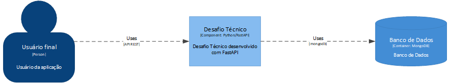

# Desafio Técnico #

😀 **Mario Guedes**

✉ jmarioguedes@gmail.com

🔗 https://www.linkedin.com/in/jmarioguedes/

---


---

## Executando os testes unitários ##

Após baixar os fontes é necessário criar o ambiente virtual e instalar as dependências do projeto. 

Se posicione na raiz do repositório e execute a seguinte sequência de comandos:

```shell
python -m venv venv
.\venv\Scripts\activate.ps1
make install
make tests
open .\htmlcov\index.html
```

## Executando o artefato e o MongoDB em container ##

O projeto contêm um `docker-compose.yml` já preparado para executar o artefato e um banco de dados local. 

Para executar as imagens siga a seguinte sequência de comandos:

```shell
docker compose build
docker compose up
```

## Acessando a API Rest ##

Com o artefato em funcionamento pode-se acessar a documentação gerado pelo framework [FastAPI](https://fastapi.tiangolo.com/).

🔗 http://localhost:8080/api/redoc

🔗 http://localhost:8080/api/docs


